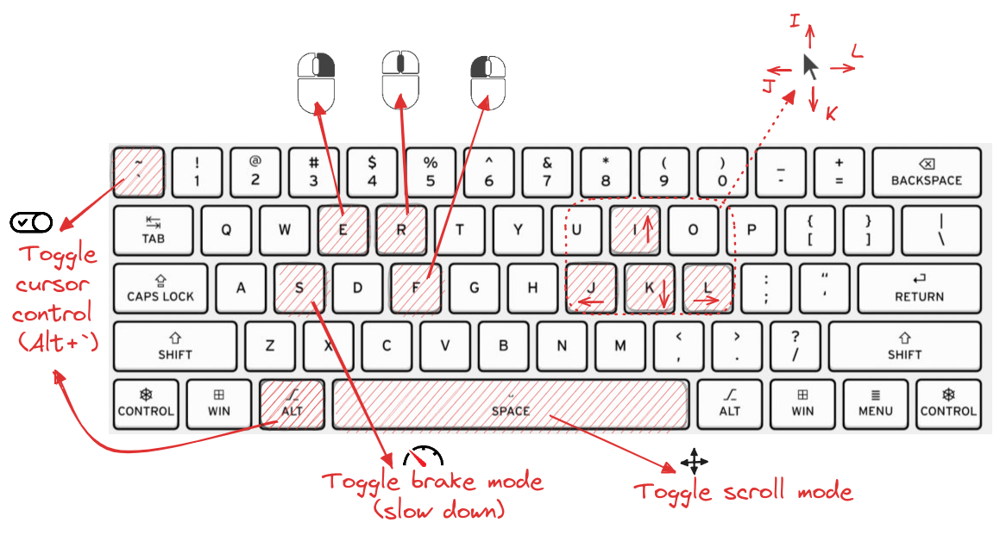
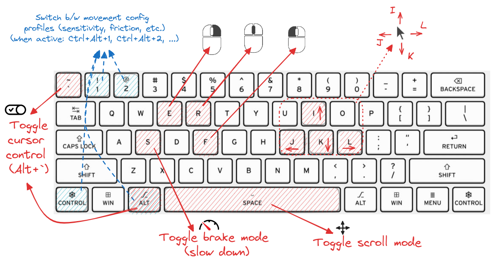

# Cursor Conductor


<span style="text-align: center; display: block;">
A simple first-attempt at a cross-platform desktop (electron) app to control mouse cursor position, scroll and clicks via keyboard shortcuts. Inspired by <a href="https://github.com/EsportToys/TPMouse">EsportToys/TPMouse</a>.
</span>
<br />
<br />


## Table of Contents

- [Cursor Conductor](#cursor-conductor)
  - [Table of Contents](#table-of-contents)
  - [Why?](#why)
  - [Installation](#installation)
  - [Usage](#usage)
  - [Commands](#commands)
  - [Dependencies](#dependencies)
  - [Related](#related)
  - [License](#license)
  - [FAQ](#faq)

## Why?

Using a mouse is great, but sometimes it's nice to be able to control the cursor with the keyboard, too. 🤷‍♂️ This little app enables just that. It's inspired by [EsportToys/TPMouse](https://github.com/EsportToys/TPMouse), which is a nifty tool that does the same. Unfortunately, it seems to be Windows-only (written in AutoIt-- a scripting language for automating the Windows GUI), and I wanted to be able to use it on other platforms, too, so I decided to try and build something similar from scratch using JavaScript. This is the first iteration of that attempt. It's definitely still a work in progress, but works well enough for me so far. Hopefully, it'll be useful to someone else, too. 🙂

## Installation

The app can be installed in two ways:

1. **Directly from GitHub:** [Download the app from GitHub](https://github.com/arazzz/cursor-conductor/releases/latest) and run the installer/executable (e.g., `.exe` for Windows, `.dmg` for macOS, `.AppImage` for Linux).
2. **Cloning the repo locally and installing dependencies with a node package manager (e.g., [`npm`](https://docs.npmjs.com/), [`yarn`](https://yarnpkg.com/), [`pnpm`](https://pnpm.io/), [`bun`](https://bun.sh/)):** `git clone https://github.com/arazzz/cursor-conductor.git && cd cursor-conductor && bun install`

To install dependencies (e.g., using `bun`), run:

```bash
bun install
```

You can also build the app for your current platform with `bun build`, which will create a `dist` folder in the project root with the built app:

```bash
bun build
```

## Usage

To start the app in dev mode (uses nodemon to restart on file changes), run:

```bash
bun dev
```

To start the app normally, run:

```bash
bun start
```

Once the app is running, you can use the following default shortcuts to control the cursor:

- **Alt+`**: Toggle cursor control on/off.
- **I**: Move cursor up.
- **K**: Move cursor down.
- **J**: Move cursor left.
- **L**: Move cursor right.
- **F**: Left click.
- **E**: Right click.
- **R**: Middle click.
- **S**: Toggle brake mode (slows down the cursor movement).
- **Space**: Toggle scrolling mode (scrolls up/down when moving the cursor up/down or left/right).

You can change the default shortcuts by editing the `src/config/config.default.js` file, or by selecting "Open Config" from the app menu in the system tray (opens a config file stored in your home directory and allows you to edit it in your default text editor; changes to this file will be reflected in the app without requiring a restart).
You can also specify different configuration profiles (modes) in the config file and switch between them (when the app is active [when **Alt+`** has been pressed]) by pressing **Ctrl+Alt+1**, **Ctrl+Alt+2**, **Ctrl+Alt+3**, etc. where the number indicates the mode number (see the [config](./src/config/config.default.js) file for more info). Different configurations can be useful for different use cases (e.g., different mouse sensitivity settings for different apps, one for general use, another for gaming, etc.). Currently, the app contains two default modes; mode 2 uses acceleration/deceleration to determine cursor movement, while mode 1 does not (see the [mouse actions](./src/lib/mouseActions.js) file for more info).



## Commands

NPM scripts in the package.json file:

- **dev**: Start the app in dev mode (uses nodemon to restart on file changes).
- **start**: Start the app.
- **build**: Build the app for the current platform (see [electron-builder](https://www.electron.build/) for more info).

## Dependencies

- [**electron**](https://github.com/electron/electron): A cross-platform desktop application framework with global keyboard shortcuts.
- [**electron-builder**](https://github.com/electron-userland/electron-builder): A library for building and packaging electron apps.
- [**uiohook-napi**](https://github.com/SnosMe/uiohook-napi): To capture mouse and keyboard events.
- [**@jitsi/robotjs**](https://github.com/jitsi/robotjs): To control the mouse cursor position and simulate mouse clicks.

## Related

- [EsportToys/TPMouse](https://github.com/EsportToys/TPMouse) - A virtual trackball for Windows, via vim-like homerow controls.
- [rvaiya/warpd](https://github.com/rvaiya/warpd) - A modal keyboard driven interface for mouse manipulation.
- [philc/vimium](https://github.com/philc/vimium) - A browser extension that provides keyboard-based navigation and control of the web in the spirit of the Vim editor.

## License

MIT License (see [LICENSE](LICENSE) for more info)

## FAQ

- **Why is the app not working?**

  - This little toy project is still in development and has not been tested well. If you find any bugs, please report them in the [issue tracker](https://github.com/arazzz/cursor-conductor/issues). If you have any suggestions on how to improve and/or extend the app, please feel free to open a [pull request](https://github.com/arazzz/cursor-conductor/pulls). Thank you for your understanding and support. 🙂

- **Why does this use Electron?**

  - Probably no good reason, 😶 but keyboard shortcuts registered via Electron's [globalShortcut](https://www.electronjs.org/docs/latest/api/global-shortcut) module are suppressed by default (i.e., key events are kept from being passed down to / processed by other apps down the line), which is a requirement for this sort of tool to work properly... Plus, Electron's simplicity and cross-platform compatibility offer too easy of a starting point to pass up. 😅 It's just a start, though. I'm sure there are better ways to do this-- hopefully, I'll find out about them soon. 🤞
